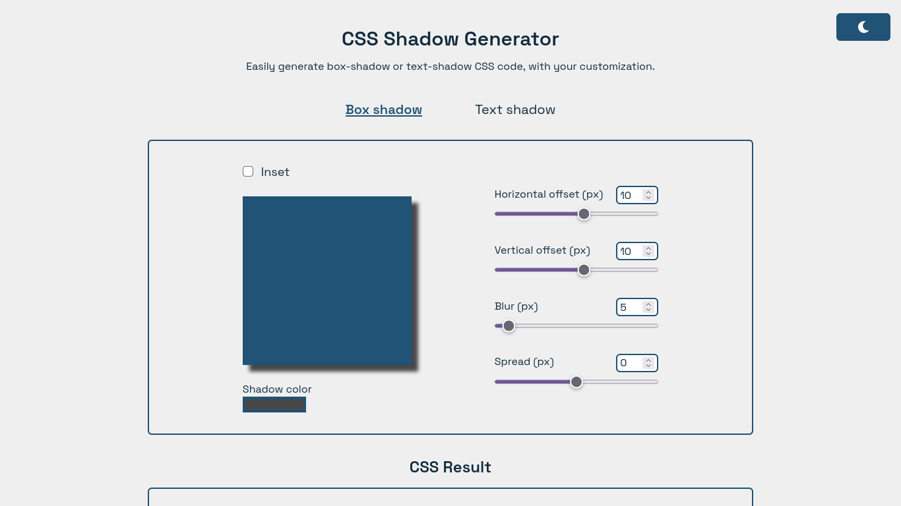

# CSS Shadow Generator

A website to help you generate box-shadow or text-shadow CSS code with your customization. 
Just set the slider and color, copy the result code, and then put it in your CSS code.

## Screenshot

## Tech Stack

- Vite
- React
- Tailwind CSS
- Redux-toolkit

**Additional libraries:** 
- React Router v6
- React Hot Toast
- React Colorful
- PropTypes
- etc

## Demo

[Demo link](https://css-shadow-gen.vercel.app)

